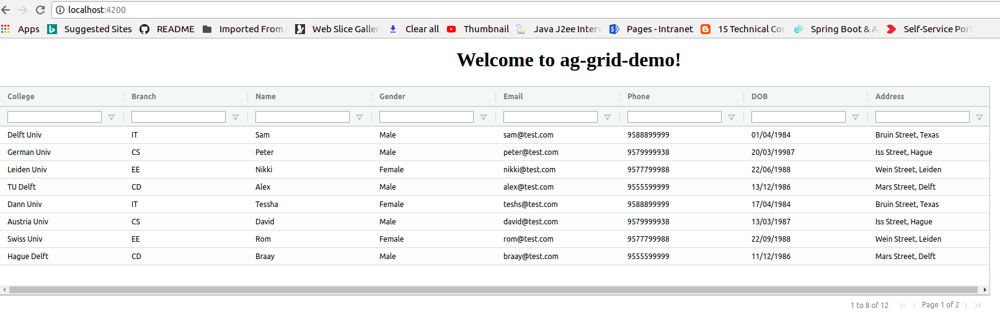

# AngularAgGridDemo

This project was generated with [Angular CLI](https://github.com/angular/angular-cli) version 6.0.8.

### ag-grid

The "ag" part of ag-Grid stands for "agnostic". The internal ag-Grid engine is implemented in TypeScript with zero dependencies. ag-Grid supports Angular through a wrapper component. The wrapper lets you use ag-Grid in your application like any other Angular component – you pass configuration through property bindings and handle events through event bindings. You can even use Angular components to customize the grid UI and cell contents / behavior.

Refer this link https://www.ag-grid.com/angular-getting-started/

### Install
```
npm install --save ag-grid ag-grid-angular

```
***app.module.ts***

```
@NgModule({
  declarations: [AppComponent],
  imports: [BrowserModule, AgGridModule.withComponents([])],
  providers: [],
  bootstrap: [AppComponent]
})
```
***style.css***

```
@import "~ag-grid/dist/styles/ag-grid.css";
@import "~ag-grid/dist/styles/ag-theme-balham.css";
```

***app.component.html***

```
<ag-grid-angular 
    style="width: 87%; height: 370px;" 
    class="ag-theme-balham"
    [rowData]="rowData" 
    [columnDefs]="columnDefs"

    [enableSorting]="true"
    [multiSortKey]="multiSortKey"
    [animateRows]="true"

    [pagination]="true"
    [paginationPageSize]="8"

    [enableFilter]="true"
    [floatingFilter]="true"

    >
</ag-grid-angular>
```
### Screenshot


### Happy Coding
